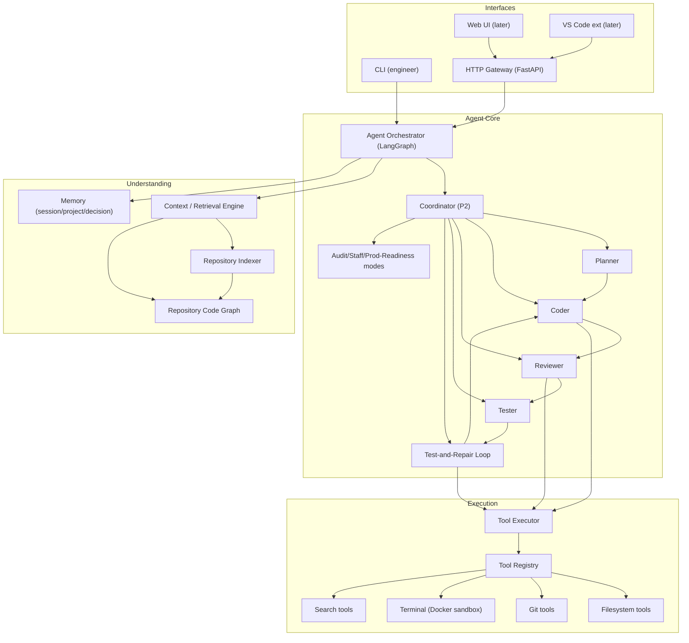

# Target Architecture

The end-state architecture for the `coding-agent` project, derived from the
project specification and constrained by the existing implementation
(see `docs/PROJECT_GAP_ANALYSIS.md`).

Guiding principles:

- **Modular monolith.** No microservices unless load actually demands it.
- **Interface-independent core.** CLI, Web UI, and VS Code extension are thin
  adapters over the same agent core.
- **Do not rewrite working functionality.** The LangGraph orchestration,
  sandboxed tools, and durable persistence are reused as-is.
- **Simple, modular, observable, testable, extensible, secure.**

---

## 1. Target architecture

The **HTTP Gateway, orchestrator, agents, tools, and executor already exist**
and remain the core. The new surface is the **CLI**, the **understanding
layer** (indexer, retrieval, code graph, memory), and the **modes** that sit
on top of the loop (test-and-repair, review/audit, system design,
distributed-systems analysis).

---

## 2. Module mapping (existing → target)

| Target component | Existing module | Status |
|---|---|---|
| HTTP Gateway | `app/gateway/` (FastAPI, SSE, retry/cancel) | **Keep.** Add auth later (P1). |
| Agent Orchestrator | `app/orchestrator/orchestrator.py` | **Keep.** |
| Agent loop | `app/agents/base.py` (`LoopAgent`) | **Keep.** |
| Coder | `app/agents/coder.py` | **Keep.** |
| Pipeline (planner/coder/reviewer/tester) | `app/agents/pipeline.py` | **Keep.** Reused by the coordinator and modes. |
| LLM abstraction | `app/llm/` (protocol, openai, anthropic, factory) | **Keep.** Add Gemini (P1). |
| Tool contracts | `app/tools/` (`ToolCall`/`ToolResult`/`ToolSpec`, registry) | **Keep.** Add tools (P0). |
| Tool executor | `app/executor/executor.py` | **Keep.** |
| Terminal sandbox | `app/executor/sandbox.py` | **Keep.** |
| Path confinement | `app/executor/paths.py` | **Keep.** |
| Persistence | `app/database/` (models, repos, Alembic, pgvector) | **Keep.** Add `code_chunks` repo + index. |
| Event bus / streaming | `app/orchestrator/broker.py` + SSE routes | **Keep.** Add token-level streaming (P1). |
| **CLI** | — | **New (P0).** Thin adapter over orchestrator + a shared client. |
| **Repository indexer** | `app/retrieval/` (empty) | **New (P0).** |
| **Retrieval / context engine** | `app/retrieval/` + `code_chunks` | **New (P0).** |
| **Code graph** | `app/architecture/` (`deps`, `render`) | **Done (P1).** `engineer graph` text/Mermaid; metrics (hubs/cycles/orphans/layers). |
| **Memory** | `app/memory/` (empty) | **New (P1).** |
| **Test-and-repair loop** | — | **New (P0).** |
| **Modes** (audit/design/analyze/modernize) | `app/audit/` + `app/architecture/report.py` | **Partial (P1/P2).** audit + arch done; design/analyze open. |
| **Observability** | `app/monitoring/` (empty) + structlog | **New (P1).** |
| **Evals harness** | `app/evals/` (empty) | **New (P1).** |
| **Auth** | `users` model + repo only | **New (P1).** |
| Deployment | `docker-compose.yml`, `infra/*` | **Keep.** Add CI/CD + K8s (P2). |

---

## 3. Architectural decisions for the target state

1. **CLI is an adapter, not a rewrite.** It calls the same
   `Orchestrator`/agents in-process (or the HTTP gateway for remote use). One
   agent core, many frontends.
2. **Retrieval is pluggable and offline-first.** An `Embedder` protocol
   mirrors `LLMProvider`; a local/simple embedder is the default so indexing
   works without a paid API; OpenAI-compatible embeddings are optional.
3. **Context selection is task-specific.** A `ContextAssembler` takes a goal,
   queries the index/code graph, and returns a ranked, size-bounded set of
   files/chunks — never the whole repository.
4. **Real test execution, simulated verdicts removed.** The tester becomes a
   real test runner that parses suite output into structured failures; the
   repair loop (analyze → fix → re-run, bounded attempts) is a first-class
   graph node.
5. **Safety is layered**: sandbox (exists) + command allow/deny rules +
   destructive-command confirmation + approval gate for planning.
6. **LangGraph is the one state-machine.** New modes are new graphs (or
   composed nodes) reusing `LoopAgent`, exactly as the pipeline already does.
7. **Everything is config via env** (pydantic-settings), as today; a YAML
   config file is optional later, never required.

---

## 4. Phased implementation plan

### P0 — Core product (make it genuinely useful)

Order matters; each step keeps the suite green.

1. **P0-A CLI foundation**
   - `engineer` console entry point (session prompt), commands skeleton
     (`init`, `status`, `"task"`, `review`, `test`, `diff`, `commit`).
   - Rich TTY UX: streaming output, progress, tool-visibility, cancellation,
     history, structured errors.
   - Wire the CLI to the in-process orchestrator + a fixture workspace;
     `engineer "goal"` runs `coder` and, on `agent_type`, the pipeline.
2. **P0-B Repository discovery + indexing**
   - `engineer init` / `engineer index`: walk the workspace, detect language
     (Python/Java/TypeScript/JavaScript first), chunk source files into
     `code_chunks`, extract symbols (classes/functions/methods/imports) via
     AST/parser libraries where available.
   - Index service + `CodeChunkRepository`; idempotent re-index.
3. **P0-C Context retrieval**
   - Keyword search (glob → ripgrep-style) + symbol lookup against the index.
   - `ContextAssembler` returning a ranked context window for a goal.
   - Feed assembled context into the loop as an initial system/user context.
4. **P0-D Planning + approval**
   - Structured plan artifact (objective/assumptions/files/deps/risks/
     validation) produced by the planner stage.
   - Approval gate: CLI prompts before execution when the plan involves
     writes/destructive steps; `--yes` for automation.
5. **P0-E Safety controls**
   - Command allow/deny rules + destructive-command confirmation
     (`rm`, `git reset --hard`, `git push --force`, etc.).
   - Add `edit_file` (diff-based) tool so changes are surgical.
6. **P0-F Test execution + test-and-repair loop**
   - `test_run` tool: run the suite in the sandbox, parse output into
     structured failures (pytest/ts-jest/etc.).
   - Repair graph node: analyze failure → fix → re-run, bounded attempts
     (config `test_max_repairs`).
7. **P0-G CLI task completion + tests**
   - Full `engineer "task"` flow: context → plan → approval → execute →
     test-and-repair → review summary → diff.
   - Tests: CLI tests (in-process), indexer tests, retrieval tests, repair
     loop tests, end-to-end fixture-repo golden path.

### P1 — Differentiation

8. **Review/audit modes**: standalone structured review (severity/file/line/
   problem/reason/fix); `engineer audit` staff-engineer + production-readiness
   scores backed by evidence.
9. **Architecture analysis + dependency graph** (file/class/module edges from
   the index). **Done**: `engineer graph` (deterministic file graph, text +
   Mermaid, hubs/cycles/orphans/layers) and `engineer arch` (LLM analysis
   seeded by the graph).
10. **Distributed-systems analysis** and **system-design mode** (Mermaid
    diagrams). Partial: `engineer arch --mermaid`; `engineer design "..."`
    still open.
11. **Memory**: session/project/decision memory, inspectable/editable
    (`engineer memory`, `memory list`, `memory clear`).
12. **Git workflow**: `log/branch/checkout/push` tools, pre-modification
    working-tree check, `engineer commit` + `engineer pr` (title/summary/
    changes/tests/risks/migration notes).
13. **Auth + workspace/session management APIs** (register/login/refresh/
    logout/me; user-scoped workspaces and sessions; ownership checks) — the
    previously-planned Phase 9.
14. **Observability**: OTel traces, metrics (LLM calls, tokens, latency, cost,
    tool failures, task/test success), token-level streaming to CLI.
15. **Evaluation framework**: benchmark tasks (fix auth bug, add REST endpoint,
    add DB migration, fix failing test, optimize query, find security issue),
    headless runner, result store, multi-model comparison.

### P2 — Advanced

16. **Coordinator + parallel agents**: intent → dispatch to specialized
    agents (security/perf/testing) when valuable, parallel where safe.
17. **Legacy modernization**, security/performance analysis modes.
18. **MCP tool integration** (GitHub/Jira/DBs/cloud) — tool layer is already
    spec-based; add an MCP adapter.
19. **Deployment**: CI/CD pipeline, K8s manifests + autoscaling, observability
    stack.
20. **Web UI / VS Code extension** on the same gateway.

---

## 5. Acceptance criteria per phase

- **P0 exit criteria:** `engineer "task"` on a fixture repo performs
  context → plan → approval → edits → real test run → repair → review
  summary; `engineer diff` shows surgical changes; destructive commands are
  confirmed; all prior 150 tests stay green; new P0 tests added.
- **P1 exit criteria:** every new mode has tests with a mock LLM; audit
  scores cite evidence; memory is inspectable; auth protects every endpoint;
  evals run benchmark tasks headlessly against mock + optional real LLMs.
- **P2 exit criteria:** coordinator adds measurable value over the fixed
  pipeline; MCP adapter demoed; deployment manifests included.

---

## 6. Explicit non-goals (for now)

- No microservices split of the monolith.
- No Kubernetes until P2.
- No payments/billing, no multi-tenant SaaS wiring.
- No requirement that any mode works without an LLM provider — but every test
  must work with a fake/mock LLM.
